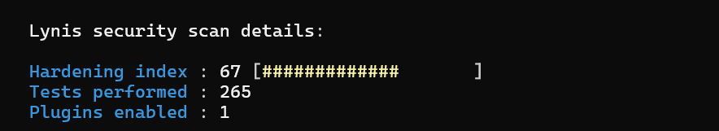

#  Project Fortress: Linux Server Hardening
**Current Status:** Phase 1 Baseline - 67 Hardening Index

##  Project Overview
This repository documents the security hardening of an Ubuntu 24.04 LTS server. The goal is to move from a default configuration to a high-security environment based on the Lynis auditing framework.

##  Key Achievements
* **Hardening Score:** Achieved a **67 Index** after initial remediation steps.
  

* **Intrusion Prevention:** Deployed **Fail2Ban**; verified via stress test where the system automatically banned a brute-force IP.
* **Firewall Integrity:** Configured **UFW** to drop unauthorized traffic, resulting in a stealth "Connection timed out" state for blocked users.
* **Identity Management:** Hardened `/etc/login.defs` and SSH daemon parameters.

## Documentation
* **Full Audit Report:** [lynis-audit-results.txt.](https://github.com/Princess2630/Linux-Hardening-Fortress/blob/5090cd4744e543c4057b786d8c1b85fe606e27fe/lynis-audit-results.txt)
* **Remediation To-Do List:**
  - [ ] Implement `auditd` for system-wide logging.
  - [ ] Configure GRUB bootloader password protection [BOOT-5122].
  - [ ] Harden 37 unconfined AppArmor processes.
